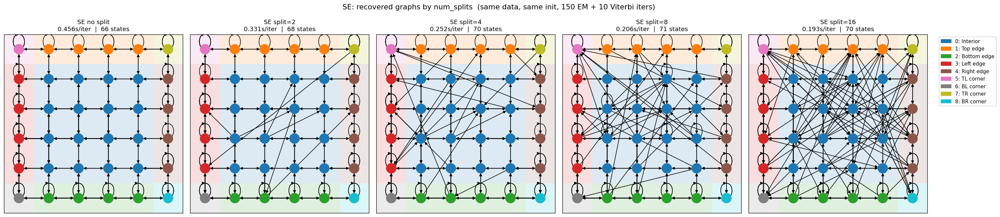
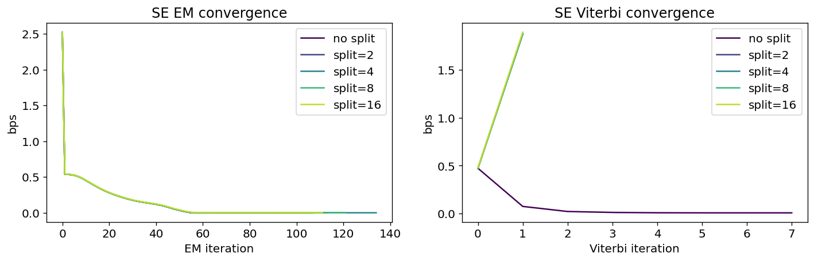
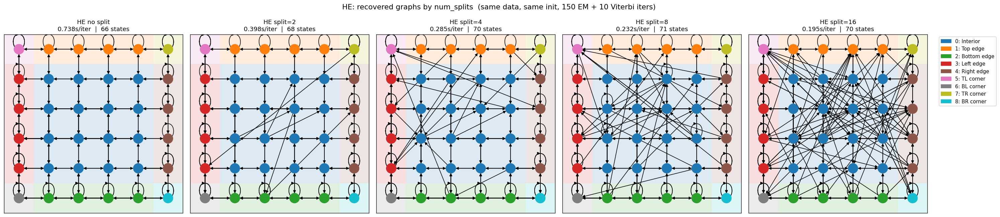
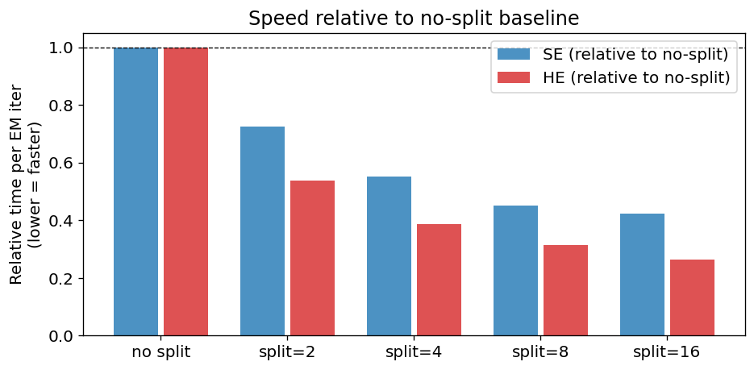
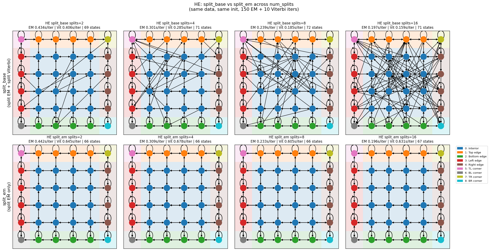

# Split training ablation: num_splits ∈ {no-split, 2, 4, 8, 16}

**Setup:** 6×6 colored grid world, T=119,936 steps, seed=0.
All models within each type (SE/HE) start from the same initial counts matrix.
The only difference is the number of sequence splits used during EM/Viterbi training.
EM: up to 150 iters (early stop). Viterbi: 10 iters.
Timing: steady-state EM wall-clock (after 1 JIT-warmup iter), averaged over 15 iterations.

Ground truth: 6×6 = 36 grid cells, 108 total clones.

---

## Soft evidence (SE) results

### Recovered graphs

### Convergence

### Summary table

| Model | Decoded states | EM iters | EM final bps | Vit iters | Vit final bps | sec/EM iter | Speedup vs no-split |
|---|---|---|---|---|---|---|---|
| no split | 66 | 108 | 0.0006 | 8 | 0.0075 | 0.456s | 1.00× |
| split=2 | 68 | 114 | 0.0009 | 2 | 1.8740 | 0.331s | 1.38× |
| split=4 | 70 | 135 | 0.0016 | 2 | 1.8737 | 0.252s | 1.81× |
| split=8 | 71 | 122 | 0.0030 | 2 | 1.8815 | 0.206s | 2.22× |
| split=16 | 70 | 112 | 0.0058 | 2 | 1.8936 | 0.193s | 2.36× |

---

## Hard evidence (HE) results

### Recovered graphs

### Convergence

### Summary table

| Model | Decoded states | EM iters | EM final bps | Vit iters | Vit final bps | sec/EM iter | Speedup vs no-split |
|---|---|---|---|---|---|---|---|
| no split | 66 | 108 | 0.0006 | 8 | 0.0075 | 0.738s | 1.00× |
| split=2 | 68 | 114 | 0.0009 | 2 | 1.8738 | 0.398s | 1.86× |
| split=4 | 70 | 133 | 0.0016 | 2 | 1.8728 | 0.285s | 2.59× |
| split=8 | 71 | 119 | 0.0030 | 2 | 1.8820 | 0.232s | 3.18× |
| split=16 | 70 | 109 | 0.0058 | 2 | 1.8922 | 0.195s | 3.78× |

---

## Speed comparison

### SE per-iteration timing

| num_splits | sec/EM iter | speedup |
|---|---|---|
| no split | 0.456s | 1.00× |
| split=2 | 0.331s | 1.38× |
| split=4 | 0.252s | 1.81× |
| split=8 | 0.206s | 2.22× |
| split=16 | 0.193s | 2.36× |

### HE per-iteration timing

| num_splits | sec/EM iter | speedup |
|---|---|---|
| no split | 0.738s | 1.00× |
| split=2 | 0.398s | 1.86× |
| split=4 | 0.285s | 2.59× |
| split=8 | 0.232s | 3.18× |
| split=16 | 0.195s | 3.78× |

---

The Viterbi failure in `split_base` is caused by segment-boundary
discontinuities in the backtraced state sequence. `split_em` fixes this by using
the base class's sequential (non-split) `_forward_mp` and `_backtrace` for Viterbi
training, while still applying split to the sum-product EM forward and backward
passes for speed.

**Setup:** Same data, same initial weights, same hyperparameters as above.
num_splits ∈ {2, 4, 8, 16}.
Timing: steady-state (after 1 JIT-warmup iter), averaged over 15 iters.

### SE: recovered graphs

### HE: recovered graphs

