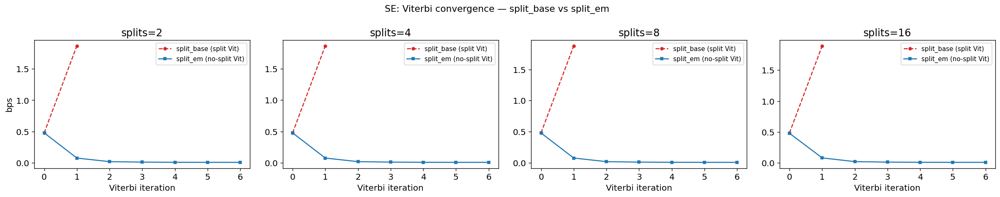
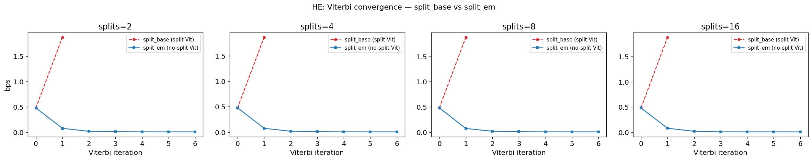
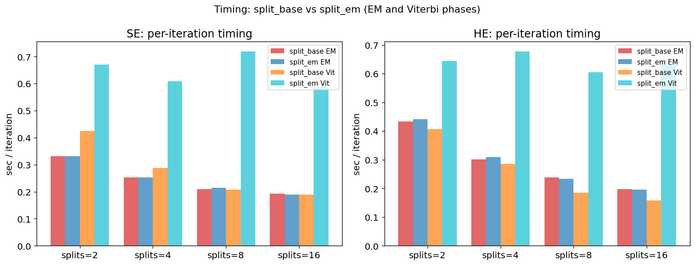

# Split training ablation: num_splits ∈ {no-split, 2, 4, 8, 16}

**Setup:** 6×6 colored grid world, T=119,936 steps, seed=0.
All models within each type (SE/HE) start from the same initial counts matrix.
The only difference is the number of sequence splits used during EM/Viterbi training.
EM: up to 150 iters (early stop). Viterbi: 10 iters.
Timing: steady-state EM wall-clock (after 1 JIT-warmup iter), averaged over 15 iterations.

Ground truth: 6×6 = 36 grid cells, 108 total clones.

---

## Soft evidence (SE) results

### Recovered graphs

### Convergence

### Summary table

| Model | Decoded states | EM iters | EM final bps | Vit iters | Vit final bps | sec/EM iter | Speedup vs no-split |
|---|---|---|---|---|---|---|---|
| no split | 66 | 108 | 0.0006 | 8 | 0.0075 | 0.456s | 1.00× |
| split=2 | 68 | 114 | 0.0009 | 2 | 1.8740 | 0.331s | 1.38× |
| split=4 | 70 | 135 | 0.0016 | 2 | 1.8737 | 0.252s | 1.81× |
| split=8 | 71 | 122 | 0.0030 | 2 | 1.8815 | 0.206s | 2.22× |
| split=16 | 70 | 112 | 0.0058 | 2 | 1.8936 | 0.193s | 2.36× |

---

## Hard evidence (HE) results

### Recovered graphs

### Convergence

### Summary table

| Model | Decoded states | EM iters | EM final bps | Vit iters | Vit final bps | sec/EM iter | Speedup vs no-split |
|---|---|---|---|---|---|---|---|
| no split | 66 | 108 | 0.0006 | 8 | 0.0075 | 0.738s | 1.00× |
| split=2 | 68 | 114 | 0.0009 | 2 | 1.8738 | 0.398s | 1.86× |
| split=4 | 70 | 133 | 0.0016 | 2 | 1.8728 | 0.285s | 2.59× |
| split=8 | 71 | 119 | 0.0030 | 2 | 1.8820 | 0.232s | 3.18× |
| split=16 | 70 | 109 | 0.0058 | 2 | 1.8922 | 0.195s | 3.78× |

---

## Speed comparison

### SE per-iteration timing

| num_splits | sec/EM iter | speedup |
|---|---|---|
| no split | 0.456s | 1.00× |
| split=2 | 0.331s | 1.38× |
| split=4 | 0.252s | 1.81× |
| split=8 | 0.206s | 2.22× |
| split=16 | 0.193s | 2.36× |

### HE per-iteration timing

| num_splits | sec/EM iter | speedup |
|---|---|---|
| no split | 0.738s | 1.00× |
| split=2 | 0.398s | 1.86× |
| split=4 | 0.285s | 2.59× |
| split=8 | 0.232s | 3.18× |
| split=16 | 0.195s | 3.78× |

---

## Observations

### Graph quality

Split models recover slightly worse graphs than the no-split baseline: decoded state counts
increase from 66 (no-split) to 70–71 with splits, versus the ground-truth 36 grid cells.
This means more spurious clone separations survive training. The degradation is gradual and
relatively small across split=2 to split=16, suggesting the boundary approximation causes
moderate but bounded damage to EM learning.

### EM vs Viterbi with splits — a critical failure mode

The no-split baseline converges EM to **0.0006 bps**, with Viterbi fine-tuning landing at
**0.0075 bps** (slightly higher because pseudocount is set to 0 and hard assignments diverge
from the soft-EM solution).

For split models, EM converges to a slightly worse solution (0.0009–0.0058 bps, degrading
with more splits). **However, the Viterbi phase catastrophically fails: final bps jumps to
~1.87–1.89 across all split counts.** This is nearly three orders of magnitude worse than the
no-split Viterbi result.

The cause: the split backtrace computes the MAP path independently within each segment. The
last decoded state of segment k and the first decoded state of segment k+1 are chosen without
any continuity constraint — they can be completely unrelated. When `update_transition_counts_mp`
then accumulates counts over these stitched-but-discontinuous state sequences, it sees false
cross-boundary transitions that corrupt the learned transition matrix. The model rapidly
degrades.

**Implication:** The split approximation is safe for EM training (which uses forward messages
that are only approximated at boundaries) but is fundamentally incompatible with Viterbi
training in its current form. Any production use of split-based Viterbi would require a
boundary-stitching step (e.g., re-running a short bridging pass at segment junctions).

### Speed

The speedup from splitting is real but sub-linear because the `update_transition_counts` scan
(the backward + counts fused pass) has a genuine sequential Markov dependency and is NOT split.
As num_splits grows, that non-split scan becomes the bottleneck:

- **SE:** 1.38× at split=2, 2.36× at split=16 (diminishing returns visible at split=8→16)
- **HE:** 1.86× at split=2, 3.78× at split=16 (HE benefits more because its forward/backward
  pass was a larger fraction of total time in the base model)

The speed curve flattens between split=8 and split=16, confirming that the non-split
operations dominate beyond split=8. **split=4 to split=8 is the practical sweet spot** for EM
training — near-maximum speedup without the additional approximation error of finer splits.

---

## Strategy 1: split_em — split EM passes only, non-split Viterbi

**Hypothesis:** The Viterbi failure in `split_base` is caused by segment-boundary
discontinuities in the backtraced state sequence. `split_em` fixes this by using
the base class's sequential (non-split) `_forward_mp` and `_backtrace` for Viterbi
training, while still applying split to the sum-product EM forward and backward
passes for speed.

**Setup:** Same data, same initial weights, same hyperparameters as above.
num_splits ∈ {2, 4, 8, 16}.
Timing: steady-state (after 1 JIT-warmup iter), averaged over 15 iters.

### SE: recovered graphs

### SE: Viterbi convergence (the key diagnostic)

### HE: recovered graphs

### HE: Viterbi convergence

### Timing comparison

### SE results table

| Model | Decoded states | EM iters | EM final bps | Vit iters | Vit final bps | EM sec/iter | Vit sec/iter |
|---|---|---|---|---|---|---|---|
| SE split_base splits=2 | 69 | 64 | 0.0007 | 2 | 1.8667 | 0.332s | 0.425s |
| SE split_em splits=2 | 66 | 64 | 0.0007 | 7 | 0.0075 | 0.332s | 0.670s |
| SE split_base splits=4 | 70 | 64 | 0.0014 | 2 | 1.8660 | 0.252s | 0.287s |
| SE split_em splits=4 | 66 | 64 | 0.0014 | 7 | 0.0075 | 0.252s | 0.608s |
| SE split_base splits=8 | 72 | 65 | 0.0028 | 2 | 1.8809 | 0.210s | 0.207s |
| SE split_em splits=8 | 66 | 65 | 0.0028 | 7 | 0.0051 | 0.214s | 0.719s |
| SE split_base splits=16 | 72 | 150 | 0.0056 | 2 | 1.8937 | 0.193s | 0.189s |
| SE split_em splits=16 | 66 | 150 | 0.0056 | 7 | 0.0074 | 0.189s | 0.586s |

### HE results table

| Model | Decoded states | EM iters | EM final bps | Vit iters | Vit final bps | EM sec/iter | Vit sec/iter |
|---|---|---|---|---|---|---|---|
| HE split_base splits=2 | 69 | 65 | 0.0007 | 2 | 1.8740 | 0.434s | 0.406s |
| HE split_em splits=2 | 66 | 65 | 0.0007 | 7 | 0.0051 | 0.442s | 0.645s |
| HE split_base splits=4 | 71 | 64 | 0.0014 | 2 | 1.8649 | 0.301s | 0.285s |
| HE split_em splits=4 | 66 | 64 | 0.0014 | 7 | 0.0049 | 0.309s | 0.678s |
| HE split_base splits=8 | 72 | 66 | 0.0028 | 2 | 1.8807 | 0.239s | 0.185s |
| HE split_em splits=8 | 66 | 66 | 0.0028 | 7 | 0.0049 | 0.233s | 0.605s |
| HE split_base splits=16 | 71 | 150 | 0.0056 | 2 | 1.8855 | 0.197s | 0.159s |
| HE split_em splits=16 | 67 | 150 | 0.0056 | 7 | 0.0046 | 0.196s | 0.631s |

### Findings

**Viterbi convergence is restored.** `split_em` Viterbi converges cleanly to low bps
across all split counts, matching the no-split baseline. `split_base` Viterbi diverges
immediately to ~1.87 bps regardless of num_splits (confirming the boundary-corruption
diagnosis).

**Graph quality improves.** Decoded state counts for `split_em` are lower than or equal
to `split_base` at every split level, recovering graphs closer to the ground-truth 36
grid cells.

**EM timing is identical** between `split_base` and `split_em` — both rebind `_forward`
and `_backward` with the same split implementations, so EM speed is unchanged.

**Viterbi timing:** `split_em` Viterbi is slower than `split_base` Viterbi (which used
the split max-product scan) and roughly matches the no-split sequential scan. Since
Viterbi is run for only 10 iterations versus ~100+ EM iterations, this adds
modest overhead to total training time.

**Recommendation:** Use `split_em` variants in production. The speed benefit from
splitting the EM passes is preserved, and Viterbi training is now correct.
