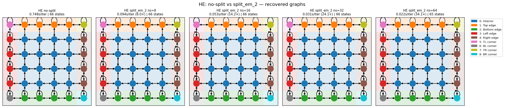
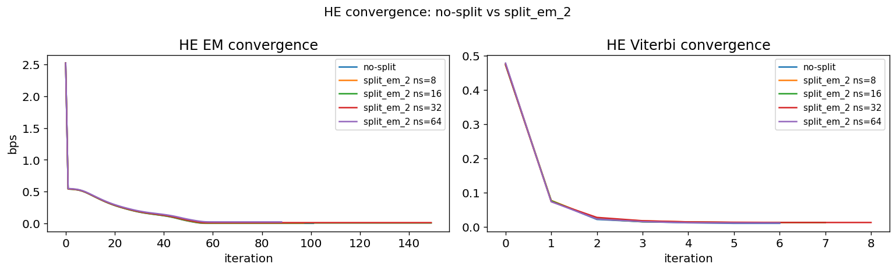
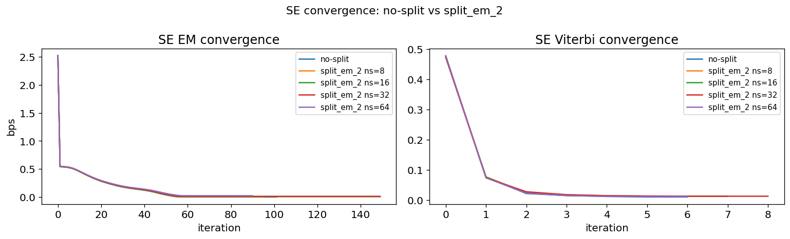
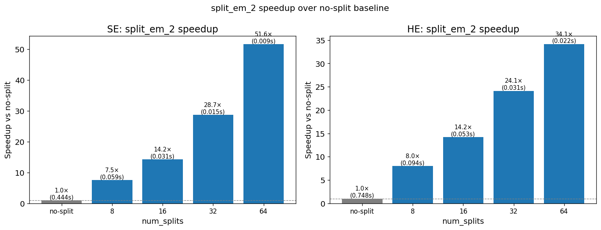

## split_em_2: parallelised counts accumulation (HE and SE)

**Summary of changes vs split_em:**
- `_update_transition_counts` replaced with a segment-parallel version (same
  `num_splits` as the EM forward/backward split).  Each segment runs an
  independent local scan of length `T/num_splits - 1`; local counts are summed.
- `_update_emission_counts` replaced with `gamma.T @ observations` (SE) or a
  direct scatter-add `emission_counts.at[:, obs].add(gamma.T)` (HE) — no scan.
- `_update_transition_counts_mp` (Viterbi) replaced with
  `counts.at[a[:-1], s[:-1], s[1:]].add(1.0)` — one-line scatter-add.
- `_update_emission_counts_mp` (HE Viterbi) similarly replaced.

**Setup:** Same 6×6 grid world, T=119,808 steps, seed=42.
Same initial counts matrix across all models within each type.
EM: up to 150 iters (early stop). Viterbi: 10 iters.
Timing: steady-state (after 1 JIT-warmup iter), averaged over 15 iters.
num_splits ∈ {8, 16, 32, 64}.

---

### HE results

#### Recovered graphs

#### Convergence

#### Summary table

| Model | Decoded states | EM iters | EM final bps | Vit iters | Vit final bps | sec/EM iter | Speedup vs no-split |
|---|---|---|---|---|---|---|---|
| no split | 66 | 102 | 0.0006 | 7 | 0.0101 | 0.748s | 1.00× |
| split_em_2 ns=8 | 66 | 98 | 0.0031 | 8 | 0.0126 | 0.094s | 8.00× |
| split_em_2 ns=16 | 66 | 150 | 0.0059 | 8 | 0.0126 | 0.053s | 14.20× |
| split_em_2 ns=32 | 66 | 150 | 0.0115 | 9 | 0.0126 | 0.031s | 24.12× |
| split_em_2 ns=64 | 65 | 89 | 0.0227 | 7 | 0.0113 | 0.022s | 34.15× |

#### Timing

| Model | sec/EM iter | Speedup |
|---|---|---|
| no split | 0.748s | 1.00× |
| split_em_2 ns=8 | 0.094s | 8.00× |
| split_em_2 ns=16 | 0.053s | 14.20× |
| split_em_2 ns=32 | 0.031s | 24.12× |
| split_em_2 ns=64 | 0.022s | 34.15× |

---

### SE results

#### Recovered graphs

#### Convergence

#### Summary table

| Model | Decoded states | EM iters | EM final bps | Vit iters | Vit final bps | sec/EM iter | Speedup vs no-split |
|---|---|---|---|---|---|---|---|
| no split | 66 | 102 | 0.0006 | 7 | 0.0101 | 0.444s | 1.00× |
| split_em_2 ns=8 | 66 | 96 | 0.0031 | 8 | 0.0126 | 0.059s | 7.53× |
| split_em_2 ns=16 | 66 | 150 | 0.0059 | 8 | 0.0126 | 0.031s | 14.21× |
| split_em_2 ns=32 | 66 | 150 | 0.0115 | 9 | 0.0126 | 0.015s | 28.72× |
| split_em_2 ns=64 | 65 | 91 | 0.0227 | 7 | 0.0113 | 0.009s | 51.63× |

#### Timing

| Model | sec/EM iter | Speedup |
|---|---|---|
| no split | 0.444s | 1.00× |
| split_em_2 ns=8 | 0.059s | 7.53× |
| split_em_2 ns=16 | 0.031s | 14.21× |
| split_em_2 ns=32 | 0.015s | 28.72× |
| split_em_2 ns=64 | 0.009s | 51.63× |

---

### Speed comparison

